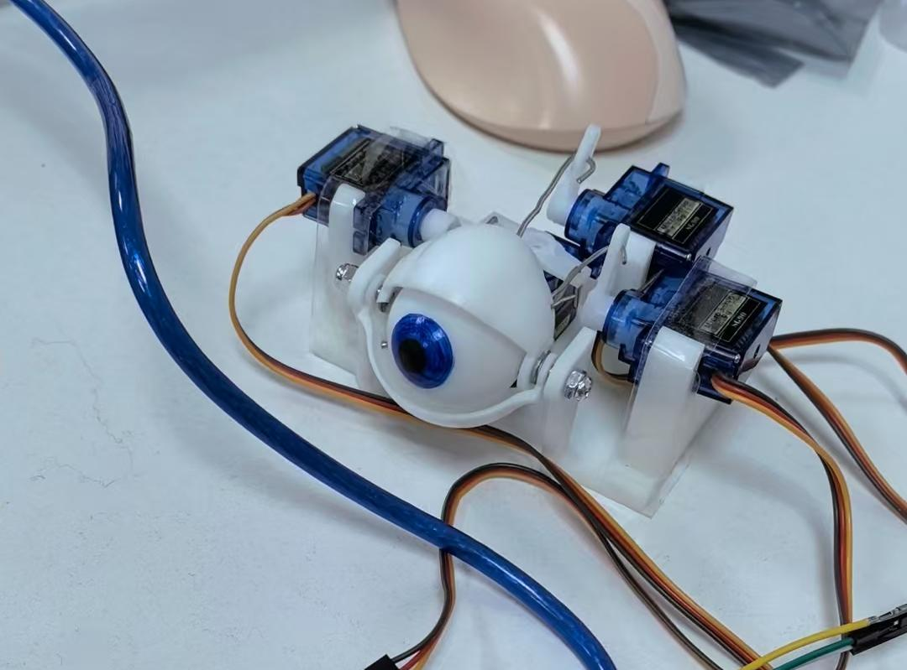
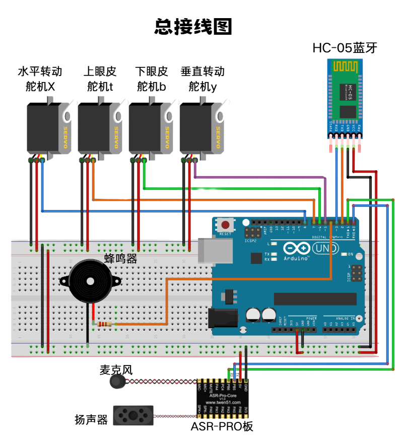

## 眼球音箱简介

这是我在大三《感知、通信与控制》课程上实现的一个机器人作品。主要参考了已有开源项目的机械结构https://www.bilibili.com/opus/180247910420902809，并加入了音箱效果。

## 视频和PPT

[点击下载视频](../assets/眼球音箱视频.mp4)

[点击下载PPT](../assets/眼球音箱水印版.pdf)

## 部分图片展示

