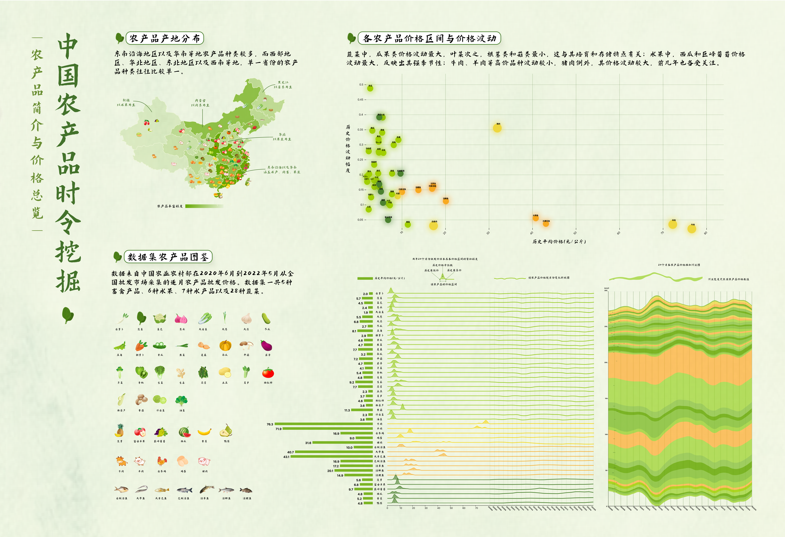
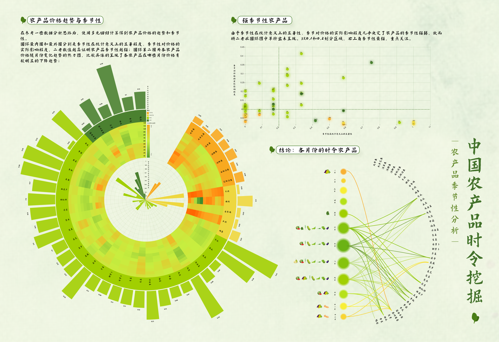

## 中国农产品时令探索项目简介

这是我在大三《跨媒体数据可视化》课程中完成的一个静态图文作品。我对中国农业部2020-2022年的农产品批发价数据进行了分析，并以图表的形式将数据进行了可视化。

## 选题背景

农产品价格和供需关系密切相关，其时令性是影响供求变化的重要因素。例如西瓜作为夏季时令水果，其产量在夏季达到高峰，价格相对较低。合理地根据时令选购农产品不仅能降低消费者的开销，还能获得更高质量、更健康的食材。然而，农产品种类繁多且价格波动复杂，仅凭经验难以精准掌握其季节性规律。因此，依托数据分析技术，从历史批发价格中揭示农产品的季节性特点，能够为消费者提供科学依据，帮助其在适当的时令季节选择性价比更高的食材。本项目通过可视化手段系统化呈现这些规律，使普通消费者也能轻松理解和应用，为日常饮食决策提供科学支持。

## 最终呈现

