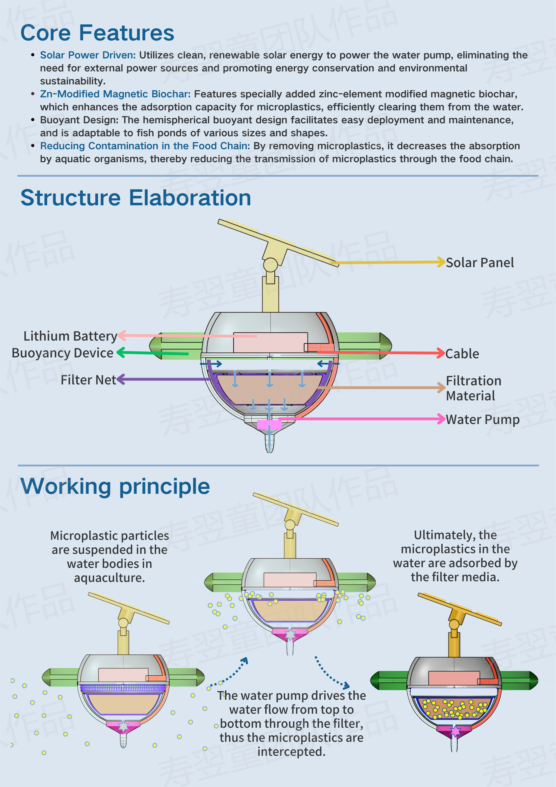

## SolarCharSphere 水体微塑料净化装置

这是我在大二的时候五人合作完成的一个生态设计作品。在产品设计过程中，我们重点关注技术、材料的落地性和产品ROI。我们希望我们的产品能低成本有效解决“水产养殖中微塑料过量”的问题。

## PPT以及视频

https://www.canva.cn/design/DAGd3FjaomA/ls5MygGIu-nxoPO1H8AOSw/edit?utm_content=DAGd3FjaomA&utm_campaign=designshare&utm_medium=link2&utm_source=sharebutton)

## 版面展示

